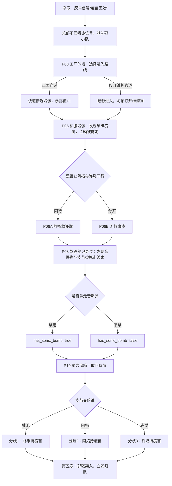
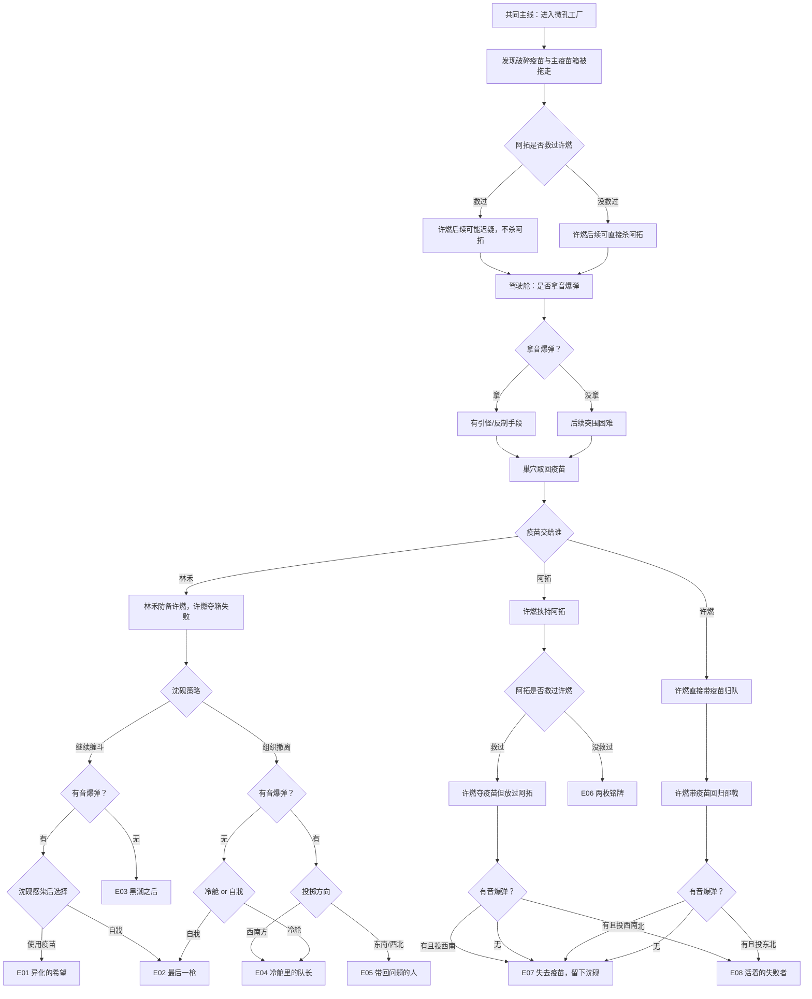

# 《微孔：疫苗坠落》沈砚线游戏脚本文件 v0.2

> 类型：视觉小说 / 互动叙事 / 生存悬疑  
> 主角线：沈砚线  
> 核心主题：疫苗不是确定的救世主，沈砚线的玩家体验是“在不确定中护送希望，并承担判断错误的代价”。  
> 当前版本目标：将现有沈砚线整理为可用于开发、原型绘制、脚本分镜与变量实现的 Markdown 游戏脚本。

---

## 0. 剧情总览

安全区监控室收到来自微孔过滤工厂的断续信号，信号中出现灰隼留下的“疫苗无效”。总部认为灰隼是对抗局特工，叛徒信号不能相信，于是派沈砚小队进入微孔工厂回收疫苗。

沈砚带领林禾、阿拓、许燃进入工厂，发现运输机残骸、一支破碎疫苗、被拖走的主疫苗箱，以及感染者将疫苗带入巢穴的线索。小队取回疫苗后，在撤离途中遭遇邵戟率领的对抗局队伍。许燃暴露真实身份“白鸮”，根据此前玩家选择，疫苗可能在林禾、阿拓或许燃手中，由此进入不同分支。

最终分支围绕三类问题展开：

1. 疫苗能否被带回安全区。
2. 沈砚是否感染、死亡、异化或冷舱休眠。
3. 阿拓是否因许燃背叛而死亡。

---

## 1. 主要角色

| 角色 | 身份 | 当前线路功能 |
|---|---|---|
| 沈砚 | 安全区行动队长 | 玩家扮演角色，负责路线、分组、疫苗交接和撤离选择 |
| 林禾 | 安全区疫苗研究员 | 判断疫苗状态，发现许燃异常，关键结局中决定是否面对疫苗无效 |
| 阿拓 | 安全区机械师 | 开维修闸、救许燃、修音爆弹、修冷舱，是多条分支的关键人物 |
| 许燃 / 白鸮 | 安全区通讯员；实际为对抗局卧底 | 暗中传递坐标，后期暴露并回归邵戟 |
| 邵戟 | 对抗局突击队长 | 率队抢夺疫苗，引爆第五章阵营冲突 |
| 灰隼 | 对抗局特工，运输机事件死者 | 留下“疫苗无效”信号，是序章任务起点 |
| 感染警卫 / 感染者群 | 工厂内部威胁 | 驱动战斗、追击、感染、冷舱分支 |

---

## 2. 核心变量

| 变量名 | 类型 | 默认值 | 说明 |
|---|---:|---:|---|
| `exposure_value` | 数值 | 0 | 暴露值。正面进入工厂时增加，影响邵戟提前抵达和许燃回传坐标合理性。 |
| `atok_saved_xuran` | 布尔 | false | 阿拓是否在机尾救下许燃。决定后续许燃是否杀阿拓。 |
| `has_sonic_bomb` | 布尔 | false | 沈砚是否拿走音爆弹并交给阿拓。决定后续突围是否有引怪手段。 |
| `vaccine_holder` | 枚举 | none | 疫苗持有人：`linhe` / `atok` / `xuran`。决定第五章主分歧。 |
| `xuran_exposed` | 布尔 | false | 许燃是否暴露白鸮身份。第五章固定触发。 |
| `shenyan_infected` | 布尔 | false | 沈砚是否感染。多个结局触发条件。 |
| `vaccine_recovered_by_safezone` | 布尔 | false | 安全区是否带回疫苗。 |
| `vaccine_taken_by_opposition` | 布尔 | false | 对抗局是否带走疫苗。 |
| `atok_alive` | 布尔 | true | 阿拓是否存活。 |
| `linhe_alive` | 布尔 | true | 林禾是否存活。 |
| `shenyan_state` | 枚举 | alive | `alive` / `infected` / `dead` / `mutated` / `cryo_sleep`。 |

---

## 3. 剧情流程总图

---

# 4. 正文脚本

---

## 序章

### P00 黑底旁白：最后一段信号

**背景**：黑底白字  
**人物**：无  
**文本**：

凌晨三点十七分，安全区监控室收到一段断续信号。  
信号源来自西北工业遗址。  
那里也是疫苗运输机最后消失的位置。

---

### P01 安全区监控室

**背景**：`BG_07_safezone_monitoring_room`  
**人物**：监控室人员、安全区指挥官  
**对白**：

监控室人员：信号源确认，微孔过滤工厂一带。和运输机失联坐标重合。  
安全区指挥官：把原始频段放大。不要只听自动解码。  
监控室人员：噪声太重，只能还原一小段。  
灰隼广播：疫苗……无效。  
监控室人员：灰隼？  
安全区指挥官：现已查明灰隼是潜伏在运输机上的对抗局特工。叛徒留下的信号，不能信。  
安全区指挥官：通知沈砚，立刻组建搜救小队，取回疫苗。

**画面**：沈砚、林禾、阿拓、许燃四人集结。

---

### P02 黑底旁白：出发

**背景**：黑底白字  
**人物**：无  
**文本**：

一小时后，回收小队离开安全区。  
任务是回收疫苗。  
沈砚不确定灰隼是否说了真话。  
但只要疫苗还有一丝可能，就必须有人把它带回来。

---

## 第一章：坠机残骸

### P03 工厂外墙

**背景**：`BG_01_crash_coordinates`  
**人物**：沈砚、阿拓、许燃  
**场景说明**：

运输机尾翼斜插在工厂顶部，残破编号“791”仍能辨认。  
工厂外墙早已破损，正门附近有少量感染者游荡。  
另一侧有一条废弃维护管道，疑似通向厂房内部的过滤区。

**对白**：

许燃：尾号确认，791。是那架运输机。  
阿拓：不是迫降，是砸进去的。你看屋顶断面，机身应该卡在过滤大厅上方。  
沈砚：正门情况。  
阿拓：门不用破，早烂了。问题是门口有东西。  
许燃：三只，可能四只。活动慢，没发现我们。  
阿拓：还有一条废弃维护管道，应该能绕进厂房侧面。  
沈砚：能通到残骸？  
阿拓：理论上能。坏消息是，管道出口有一道维修闸，八成锁死。  
许燃：正面通过更快。只要不交火，就不会惊动它们。  
阿拓：也更容易被看见。这里太空，连个能躲的铁皮都没有。  
沈砚：我们不是来清场的。目标是残骸和疫苗箱。

#### 判断：进入路线

##### 选项 A：正面穿过厂区

**选项文案**：从正门外侧低姿态穿过，避开感染者，直接接近机腹残骸。

**结果**：

- 不触发感染者战斗。
- 小队更快抵达飞机残骸。
- `exposure_value += 1`。
- 后续邵戟抵达时间略微提前，或许燃更容易完成一次短促坐标回传。
- 阿拓工具状态保持完整。

**沈砚对白**：

沈砚：直接穿过去，低姿态通过。

##### 选项 B：走废弃维护管道

**选项文案**：绕进废弃管道，从过滤区侧面进入，避开正门感染者。

**结果**：

- 暴露值不增加。
- 小队进入更隐蔽。
- 到达残骸时间延后。
- 触发“维修闸锁死”事件，需要阿拓开门。
- 阿拓参与感增加。
- 可埋下后续阿拓熟悉工厂管道、制作音爆装置的合理性。

**沈砚对白**：

沈砚：走管道。  
许燃：管道里信号会弱。

---

### P04 黑底旁白：进入残骸区

**背景**：黑底白字  
**人物**：无

#### 文本 A：选择正面穿过后

空旷厂区里，任何移动都很难真正隐藏。  
他们更快接近了残骸，也更早暴露在工厂的视线里。

#### 文本 B：选择废弃管道后

阿拓打开维修闸时，锁芯里挤出一截灰白色菌丝。  
它像某种已经死去的神经，仍然记得如何收缩。

---

### P05 机腹残骸

**背景**：`BG_02_filtration_hall` 或机腹残骸图  
**人物**：沈砚、林禾、阿拓、许燃  
**对白**：

林禾：这里有一支破碎的疫苗。运输机一共有两支疫苗，还有一支在哪？  
沈砚：机身断成了两截，我们分头找。  
阿拓：一支破了。主箱被拖走了。  
许燃：我去机尾找找。  
沈砚：别单独行动，两两一组。

#### 判断：是否让阿拓和许燃一组搜查机身尾部

- 选项 A：让阿拓和许燃同行 → 进入 `P06A`。
- 选项 B：不让阿拓和许燃同行 → 进入 `P06B`。

**关键分歧**：决定后续许燃是否因阿拓救命而产生迟疑。

---

## 第二章：机身尾部

### P06A 机身尾部：阿拓与许燃同行

**触发**：沈砚让阿拓和许燃一组  
**背景**：`BG_08_aircraft_tail_search`  
**人物**：阿拓、许燃，少量沈砚无线电  
**对白 / 行动**：

许燃：你先走，我检查设备，通讯频道中断了。  
许燃在阿拓背后蹲下调试通讯设备，暗中给对抗局发送消息。  
阿拓：不急，我先去看看。

过了一会儿，许燃发完消息，准备起身。  
感染警卫出现在许燃身后，正准备袭击。  
阿拓转身看向许燃，发现感染警卫。

阿拓丢出军用匕首：许燃，低头。  
许燃立马蹲下，匕首刺中感染警卫头部，感染警卫倒地。  
阿拓：怎么样，准吧。  
许燃沉默片刻，目光看向深处：谢了，继续找疫苗吧。  
沈砚（无线电）：阿拓，汇报！  
阿拓：我们遭遇了感染者，但已经被我解决了。

**结果**：

- `atok_saved_xuran = true`。
- 隐藏标记：阿拓救许燃成立。
- 许燃设备异常只作为视觉线索出现，不让人物点破。

---

### P06B 机身尾部：分开搜查

**触发**：沈砚没有让阿拓和许燃一组  
**背景**：`BG_08_aircraft_tail_search`  
**人物**：沈砚、林禾、阿拓、许燃  
**对白 / 行动**：

许燃：尾部无生命特征反应，我一个人就行。  
阿拓：我在附近找找有没有什么好玩意。  
沈砚：所有人保持频道，有情况及时反应。  
沈砚和林禾一组探索驾驶舱，阿拓在附近警戒，许燃独自探索尾部。

**结果**：

- 没有感染警卫袭击。
- 没有阿拓救许燃。
- `atok_saved_xuran = false`。
- 隐藏标记：信任链未建立。

---

### P07 黑底旁白：错过的瞬间

**背景**：黑底白字  
**人物**：无

#### 文本 A：同行后

有些债不是立刻偿还的。  
它会留在沉默里，直到枪口抬起的那一刻。

#### 文本 B：分开后

他们避开了一次危险。  
也错过了一次看清彼此的机会。

---

## 第三章：灰隼记录仪

### P08 驾驶舱记录仪

**背景**：`BG_09_cockpit_recorder`  
**人物**：沈砚、林禾  
**对白 / 行动**：

林禾：记录仪还亮着，但没有看到疫苗。  
沈砚：附近倒是有孢子痕迹，可能有感染者。  
林禾在操作台调取日志。  
沈砚在一旁警卫尸体上发现了一个打开保险但没有爆炸的小型音爆弹。

林禾：这有飞机失事前的监控视频。  
沈砚：打开看看，说不定有什么线索。

画面断断续续。  
画面中，一个研究人员重伤躺地，死死抱住疫苗箱子。  
不久后，一个感染者出现，将研究人员拖走。

林禾：为什么感染者要带走他，不应当场进食吗。  
沈砚：重点是感染者把疫苗也带走了。我们去和他们汇合吧。

#### 判断：是否拿走音爆弹

##### 选项 A：拿走音爆弹

**结果**：

- `has_sonic_bomb = true`。
- 后续可用于突围或引开感染者。

##### 选项 B：不拿音爆弹

**结果**：

- `has_sonic_bomb = false`。
- 后续缺少关键战术道具。

---

### P09 黑底旁白：深入巢穴

**背景**：黑底白字  
**人物**：无

#### 文本 A：拿走音爆弹

四人汇合。  
沈砚决定沿着孢子痕迹寻找疫苗。  
他将音爆弹交给了阿拓。

#### 文本 B：没拿音爆弹

四人汇合。  
沈砚决定沿着孢子痕迹寻找疫苗。

---

## 第四章：巢穴冷箱

### P10 巢穴冷箱

**背景**：`BG_10_nest_cold_box`  
**人物**：沈砚、林禾、阿拓、许燃  
**场景说明**：

四人进入过滤大厅。  
大厅正中有一个巨大肉球。  
研究员被菌丝包裹腐蚀，好像正被一点点吃掉。  
一旁的疫苗箱被包裹在菌丝中。

**对白 / 行动**：

林禾：箱体低温还在，疫苗没被破坏。  
阿拓：但被菌丝缠住了。电动工具一响，里面那群东西都得醒。  
许燃：大批感染者正朝这边聚集。  
沈砚：阿拓和我一起去取疫苗，速度要快。林禾、许燃，你们找撤离路线。  
阿拓 / 许燃 / 林禾：好。

林禾和许燃寻找撤离路线。  
林禾发现许燃通讯器信号灯正常，陷入思索。  
沈砚和阿拓取出疫苗返回，但感染者群已经近在咫尺。

沈砚：疫苗到手。许燃，怎么撤离？  
许燃：走运输车间，路线短，沿途风险低，从工厂次入口出去。队长，我装备少，我拿疫苗吧。  
林禾：我拿着吧，许燃还要恢复和总部通讯呢。

沈砚察觉二人反常，决定疫苗交给谁。

#### 判断：疫苗交给谁

##### 选项 A：疫苗给林禾

**结果**：

- `vaccine_holder = linhe`。
- 后续许燃叛变时，林禾有所防备。
- 进入分歧1。

##### 选项 B：疫苗给阿拓

**结果**：

- `vaccine_holder = atok`。
- 后续许燃叛变时挟持阿拓。
- 如果 `atok_saved_xuran = true`，许燃不杀阿拓。
- 如果 `atok_saved_xuran = false`，许燃开枪杀死阿拓。
- 进入分歧2。

##### 选项 C：疫苗给许燃

**结果**：

- `vaccine_holder = xuran`。
- 许燃后续直接带疫苗回归邵戟。
- 对抗局获得疫苗优势。
- 进入分歧3。

---

## 第五章：白鸮归队

### P13 黑底旁白：第二批来客

**背景**：黑底白字  
**人物**：无  
**文本**：

安全区在沈砚小队进入工厂后联络断开，尝试重新连接，但一直连接不上。  
指挥官收到一条侦察处的消息后，立即派出救援小队前去支援。

沈砚一心往车间逃亡，甩掉感染者。  
但他不知道，车间还有人在等着疫苗。

---

### P14 对抗局突入

**背景**：`BG_04_aircraft_wreckage`  
**人物**：沈砚、林禾、阿拓、许燃、邵戟  
**场景**：运输车间相遇。邵戟带队，枪指四人。

**对白**：

邵戟：把疫苗留下，还可以活着离开。  
沈砚：对抗局？  
邵戟：沈砚，好久不见，谢谢你帮我拿到疫苗。  
林禾：沈队，疫苗不能给他们，对抗局都是疯子。  
阿拓：跟他们拼了，不能让这帮崽子得逞。

---

# 5. 分歧与结局

---

## 分歧1：疫苗给林禾

### P14-1 白鸮暴露：林禾防备成功

**触发条件**：`vaccine_holder = linhe`

许燃靠近林禾准备拔枪。  
林禾发现异常，也拔枪。  
二者枪指对方。  
许燃没拿到疫苗，退到邵戟身边。

沈砚：许燃？  
林禾：许燃，你果然有问题。  
邵戟：白鸮，归队。  
双方短暂交锋，引来感染者群。  
阿拓：许燃你这个忘恩负义的家伙，沈队我们现在该怎么办？

#### 判断：继续与对抗局缠斗 / 带着疫苗组织撤离

---

### 分歧1.1：继续与对抗局缠斗

沈砚：先击退他们，再对付感染者。

#### 分歧1.1.1：已拿音爆弹

**条件**：`has_sonic_bomb = true`

三人被感染者包围。  
沈砚：阿拓，那玩意修好没？  
阿拓：早修好了，而且威力更强，正好给对抗局那帮家伙尝尝威力。

阿拓将音爆弹扔向对抗局。  
感染者朝对抗局扑去。  
对抗局被淹没，全员阵亡。  
三人小队也受到感染者攻击，混乱中沈砚为救林禾被抓伤。

林禾：沈队，你被感染了。  
阿拓：这下该怎么办？

##### 判断：给自己使用疫苗 / 自戕，让林禾和阿拓带疫苗回去

###### 结局 E01：异化的希望

**选择**：给自己使用疫苗  
**结果**：

疫苗无效，沈砚异化。  
阿拓开枪打死沈砚。  
林禾和阿拓等到了安全区救援小队，但没有疫苗。

###### 结局 E02：最后一枪

**选择**：自戕，让林禾和阿拓带疫苗回去  
**结果**：

沈砚自杀。  
林禾和阿拓等到了安全区救援小队，但没有疫苗。

---

#### 分歧1.1.2：未拿音爆弹

**条件**：`has_sonic_bomb = false`

三人被感染者包围。  
沈砚：阿拓，边打边撤。  
邵戟：沈砚，尝尝这个。

邵戟朝沈砚扔出闪光弹。  
三人小队短暂失去视觉，全员受到感染者攻击。

###### 结局 E03：黑潮之后

**结果**：

三人均死在感染者攻击下。  
对抗局等感染者退去后取走疫苗。

---

### 分歧1.2：带着疫苗组织撤离

沈砚：疫苗已经拿到手了，不要与他们缠斗。  
林禾：好，西南口可以撤离。  
阿拓：走，算许燃这小子走运。

#### 分歧1.2.1：已拿音爆弹

**条件**：`has_sonic_bomb = true`

三人被感染者包围。  
沈砚：阿拓，那玩意修好没？  
阿拓：早修好了，而且威力更强，正好给这群丑八怪尝尝。  
林禾：目前西南方向感染者最少。

##### 判断：音爆弹投掷方向

###### 选项 A：扔向西南方

阿拓拉开保险，将音爆弹扔向西南方。  
感染者一拥而上。  
三人与感染者交锋。  
沈砚殿后，被抓伤。  
小队发现冷舱，阿拓修好冷舱。

**进入结局 E04：冷舱里的队长。**

###### 选项 B：扔向东南方 / 西北方

阿拓拉开保险，将音爆弹丢向东南方或西北方感染者群。  
感染者闻声向爆炸位置移动。  
三人从西南方向顺利突破。

**进入结局 E05：带回问题的人。**

---

#### 分歧1.2.2：未拿音爆弹

**条件**：`has_sonic_bomb = false`

三人被感染者包围，陷入战斗。  
沈砚殿后被抓伤。  
小队发现冷舱。

##### 判断：让阿拓修好冷舱，自我冬眠 / 自戕，让林禾和阿拓带疫苗回去

###### 选项 A：让阿拓修好冷舱，自我冬眠

**进入结局 E04：冷舱里的队长。**

###### 选项 B：自戕，让林禾和阿拓带疫苗回去

**进入结局 E02：最后一枪。**

---

## 分歧2：疫苗给阿拓

### P14-2 白鸮暴露：阿拓持疫苗

**触发条件**：`vaccine_holder = atok`

许燃靠近阿拓。  
林禾发现异常。  
许燃快速拔枪挟持阿拓，退到邵戟身边。

沈砚：许燃？  
林禾：许燃，你果然有问题。  
邵戟：白鸮，归队。  
许燃：抱歉，沈队。  
邵戟：白鸮，这个人没用，我们只要疫苗。

---

### 分歧2.1：阿拓救过许燃

**条件**：`atok_saved_xuran = true`

许燃拿走阿拓身上的疫苗，一脚将阿拓踹回沈砚身边。

邵戟：白鸮，为什么不杀了他？  
许燃：不想浪费子弹。疫苗到手，走吧邵队，感染者要来了。  
邵戟深深看了白鸮一眼，将目光转向沈砚。  
邵戟：撤退。  
沈砚：阿拓，没事吧？  
阿拓：对不起，沈队，林博士，我弄丢了疫苗。  
林禾：感染者快来了，我们追上对抗局，夺回疫苗。  
沈砚：先突围。

#### 分歧2.1.1：已拿音爆弹

**条件**：`has_sonic_bomb = true`

三人被感染者包围。  
沈砚：阿拓，那玩意修好没？  
阿拓：早修好了，而且威力更强。  
林禾：目前西南方向感染者最少。

##### 判断：音爆弹投掷方向

###### 选项 A：扔向西南方

阿拓拉开保险，将音爆弹扔向西南方。  
感染者一拥而上，三人与感染者交锋。  
沈砚殿后被抓伤。  
小队发现冷舱，阿拓修好冷舱。

**进入结局 E07：失去疫苗，留下沈砚。**

###### 选项 B：扔向东北方向

阿拓拉开保险，将音爆弹丢向东北方向感染者群。  
感染者闻声向爆炸位置移动。  
三人从西南方向突破。

**进入结局 E08：活着的失败者。**

---

#### 分歧2.1.2：未拿音爆弹

**条件**：`has_sonic_bomb = false`

三人被感染者包围，陷入战斗。  
沈砚殿后被抓伤。  
小队发现冷舱，阿拓修好冷舱。

**进入结局 E07：失去疫苗，留下沈砚。**

---

### 分歧2.2：阿拓没有救过许燃

**条件**：`atok_saved_xuran = false`

许燃拿走阿拓身上的疫苗，挟持阿拓。

邵戟：白鸮，杀了他。  
许燃略微犹豫，开枪射杀阿拓。  
阿拓倒在地上。  
许燃：疫苗到手，走吧邵队，感染者要来了。  
邵戟将目光转向沈砚。  
邵戟：撤退。

沈砚看着前方阿拓的尸体，又看着后面被枪声吸引来的感染者，压抑悲痛，拉着林禾撤离。

林禾：沈队，我们得夺回疫苗。  
沈砚：许燃叛变，阿拓死了，我们只有两个人，先撤退。

沈砚和林禾撤退到冷链库。  
撤离路上，沈砚为保护林禾被感染者抓伤。  
沈砚知道自己要异化了。

##### 判断：自己开枪终结自己 / 让林禾击毙自己

**进入结局 E06：两枚铭牌。**

---

## 分歧3：疫苗给许燃

### P14-3 白鸮暴露：许燃持疫苗

**触发条件**：`vaccine_holder = xuran`

许燃靠近林禾准备拔枪。  
林禾发现，也拔枪。  
二者枪指对方。  
许燃带着疫苗，退到邵戟身边。

沈砚：许燃？  
林禾：许燃，你果然有问题。  
邵戟：白鸮，归队。  
许燃：疫苗到手，走吧邵队，感染者要来了。  
邵戟将目光看向沈砚。  
邵戟：撤退。  
感染者马上靠近。  
阿拓：许燃那个忘恩负义的家伙，沈队我们现在该怎么办？  
林禾：沈队，我们得夺回疫苗。  
沈砚：先撤退。

---

### 分歧3.1：已拿音爆弹

**条件**：`has_sonic_bomb = true`

三人被感染者包围。  
沈砚：阿拓，那玩意修好没？  
阿拓：早修好了，而且威力更强。  
林禾：目前西南方向感染者最少。

#### 判断：音爆弹投掷方向

##### 选项 A：扔向西南方

阿拓拉开保险，将音爆弹扔向西南方。  
感染者一拥而上。  
三人与感染者交锋。  
沈砚殿后，被抓伤。  
小队发现冷舱，阿拓修好冷舱。

**进入结局 E07：失去疫苗，留下沈砚。**

##### 选项 B：扔向东北方向

阿拓拉开保险，将音爆弹丢向东北方向感染者群。  
感染者闻声向爆炸位置移动。  
三人从西南方向突破。

**进入结局 E08：活着的失败者。**

---

### 分歧3.2：未拿音爆弹

**条件**：`has_sonic_bomb = false`

三人被感染者包围，陷入战斗。  
沈砚殿后被抓伤。  
小队发现冷舱，阿拓修好冷舱。

**进入结局 E07：失去疫苗，留下沈砚。**

---

# 6. 去重后的 8 个结局

## E01：异化的希望

**触发条件**：

- 疫苗给林禾。
- 选择继续与对抗局缠斗。
- 已拿音爆弹。
- 沈砚感染后选择给自己使用疫苗。

**结局文本**：

疫苗无效。  
沈砚异化。  
阿拓开枪打死沈砚。  
林禾和阿拓等到了安全区救援小队，但没有疫苗。

**主题表达**：

希望被错误使用时，会变成第二次伤害。

---

## E02：最后一枪

**触发条件**：

路径一：

- 疫苗给林禾。
- 选择继续与对抗局缠斗。
- 已拿音爆弹。
- 沈砚感染后选择自戕。

路径二：

- 疫苗给林禾。
- 选择带着疫苗组织撤离。
- 未拿音爆弹。
- 沈砚感染后选择自戕。

**结局文本**：

沈砚自杀。  
林禾和阿拓等到了安全区救援小队，但没有疫苗。

**主题表达**：

沈砚没有赌疫苗，也没有让自己变成感染源。

---

## E03：黑潮之后

**触发条件**：

- 疫苗给林禾。
- 选择继续与对抗局缠斗。
- 未拿音爆弹。

**结局文本**：

三人均死在感染者攻击下。  
对抗局等感染者退去后取走疫苗。

**主题表达**：

在错误时间争夺希望，会让真正靠近希望的人先死。

---

## E04：冷舱里的队长

**触发条件**：

路径一：

- 疫苗给林禾。
- 选择带着疫苗组织撤离。
- 已拿音爆弹。
- 音爆弹扔向西南方。

路径二：

- 疫苗给林禾。
- 选择带着疫苗组织撤离。
- 未拿音爆弹。
- 选择让阿拓修好冷舱，自我冬眠。

**结局文本**：

林禾和阿拓等到了安全区救援小队。  
安全区拿回疫苗。  
沈砚被冷舱休眠带回。

**主题表达**：

希望没有兑现，但死亡被暂时推迟。

---

## E05：带回问题的人

**触发条件**：

- 疫苗给林禾。
- 选择带着疫苗组织撤离。
- 已拿音爆弹。
- 音爆弹扔向东南方或西北方。

**结局文本**：

三人逃出厂区，遇到安全区救援小队。  
安全区拿回疫苗。  
沈砚、林禾、阿拓三人存活。

**主题表达**：

他们带回的不是答案，而是必须被验证的问题。

---

## E06：两枚铭牌

**触发条件**：

- 疫苗给阿拓。
- 前面没有触发“阿拓与许燃同行”。
- 许燃杀死阿拓。
- 沈砚撤离途中感染。
- 沈砚选择自我终结或让林禾击毙自己。

**结局文本**：

许燃杀死阿拓，带走疫苗。  
沈砚为保护林禾感染，最终死亡。  
林禾等到安全区救援小队，独自返回安全区。  
她带回沈砚和阿拓的铭牌。

**主题表达**：

有些没有发生的善意，会在更晚的时候变成无法阻止的枪声。

---

## E07：失去疫苗，留下沈砚

**触发条件**：

路径一：

- 疫苗给阿拓。
- 前面触发“阿拓与许燃同行”。
- 许燃夺走疫苗但放过阿拓。
- 已拿音爆弹。
- 音爆弹扔向西南方。

路径二：

- 疫苗给阿拓。
- 前面触发“阿拓与许燃同行”。
- 许燃夺走疫苗但放过阿拓。
- 未拿音爆弹。

路径三：

- 疫苗给许燃。
- 已拿音爆弹。
- 音爆弹扔向西南方。

路径四：

- 疫苗给许燃。
- 未拿音爆弹。

**结局文本**：

对抗局带走疫苗。  
沈砚在突围中感染。  
阿拓修好冷舱。  
林禾和阿拓等到安全区救援小队。  
他们没有拿回疫苗，但带回了被冷舱休眠的沈砚。

**主题表达**：

任务失败了，但死亡被暂时推迟。

---

## E08：活着的失败者

**触发条件**：

路径一：

- 疫苗给阿拓。
- 前面触发“阿拓与许燃同行”。
- 许燃夺走疫苗但放过阿拓。
- 已拿音爆弹。
- 音爆弹扔向东北方向。

路径二：

- 疫苗给许燃。
- 已拿音爆弹。
- 音爆弹扔向东北方向。

**结局文本**：

对抗局带走疫苗。  
沈砚、林禾、阿拓三人逃出厂区，遇到安全区救援小队。  
他们活了下来，但没有拿回疫苗。

**主题表达**：

活着回来，不等于完成任务。只是下一次失败还有人能讲述。

---

# 7. 结局总流程图

---

# 8. 开发备注

## 8.1 当前最重要的四个分支变量

1. `atok_saved_xuran`：决定许燃是否杀阿拓。  
2. `has_sonic_bomb`：决定突围时是否拥有引怪工具。  
3. `vaccine_holder`：决定白鸮归队后的三大主分歧。  
4. `sonic_bomb_direction`：决定感染者被引向撤离路线还是远离撤离路线。

## 8.2 当前最重要的三个情感回收

1. **阿拓救许燃 → 许燃不杀阿拓**  
   许燃不背叛对抗局，但救命债会造成迟疑。

2. **林禾发现许燃异常 → 疫苗给林禾时夺箱失败**  
   林禾的观察力决定是否能阻止许燃第一时间夺箱。

3. **沈砚感染 → 疫苗无效 / 冷舱休眠 / 自戕**  
   沈砚线最终不是“疫苗救人”，而是“玩家如何面对希望不可靠”。

## 8.3 建议后续修订点

- P02 中“沈砚坚信疫苗可以拯救世界”已经在本整理版中改为“沈砚不确定灰隼是否说了真话，但只要疫苗还有一丝可能，就必须有人带回来”。
- E02 中部分路径写“林禾和阿拓获救但没有疫苗”，若前置剧情中疫苗仍在林禾手里，需要补充“混战中疫苗箱失温/遗失/被毁”的桥段，避免逻辑断裂。
- E04 / E07 的“冷舱休眠沈砚”是强悬念结局，后续可以作为第二部或林禾线交叉节点。
