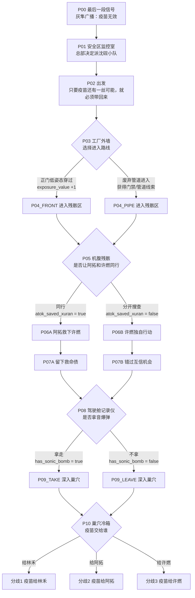
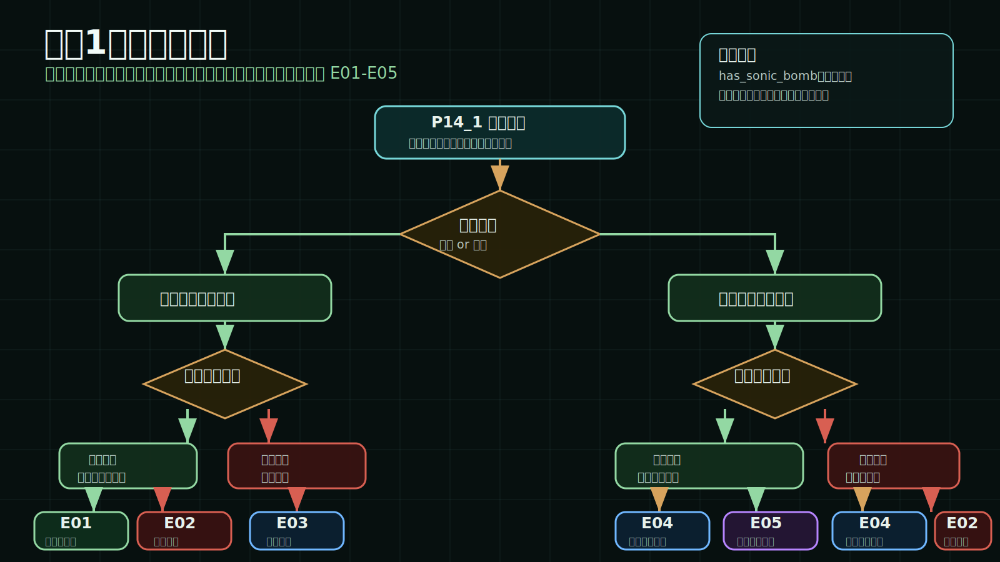
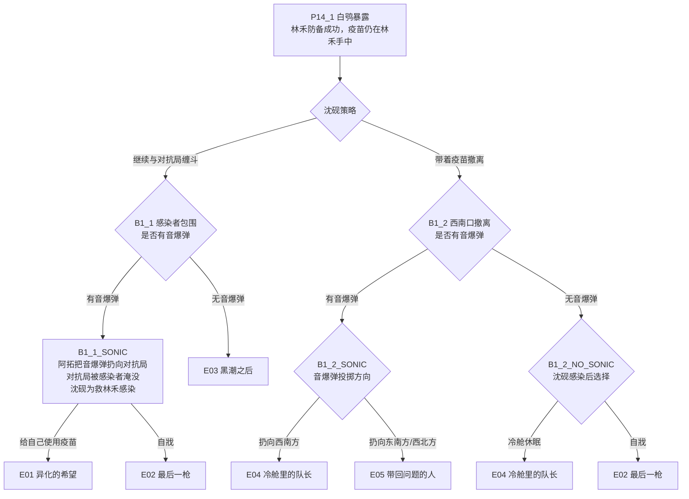
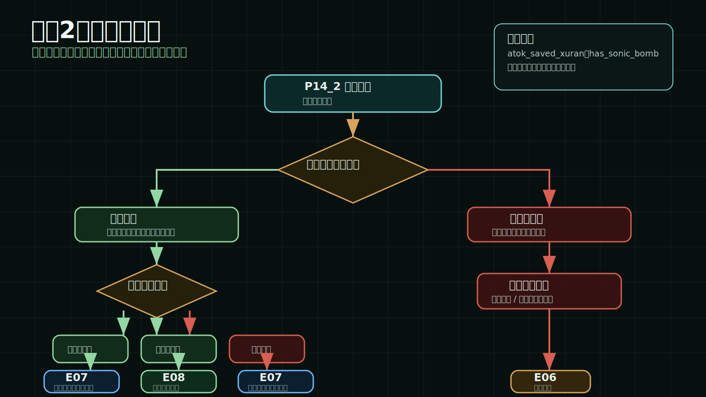
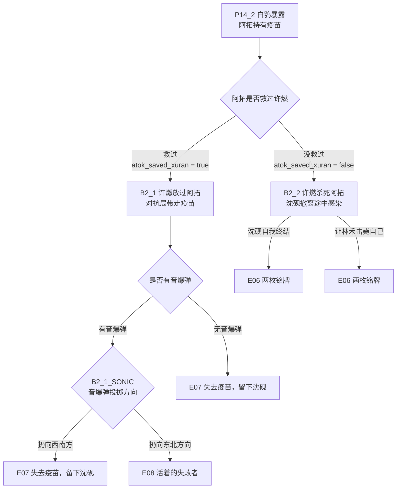
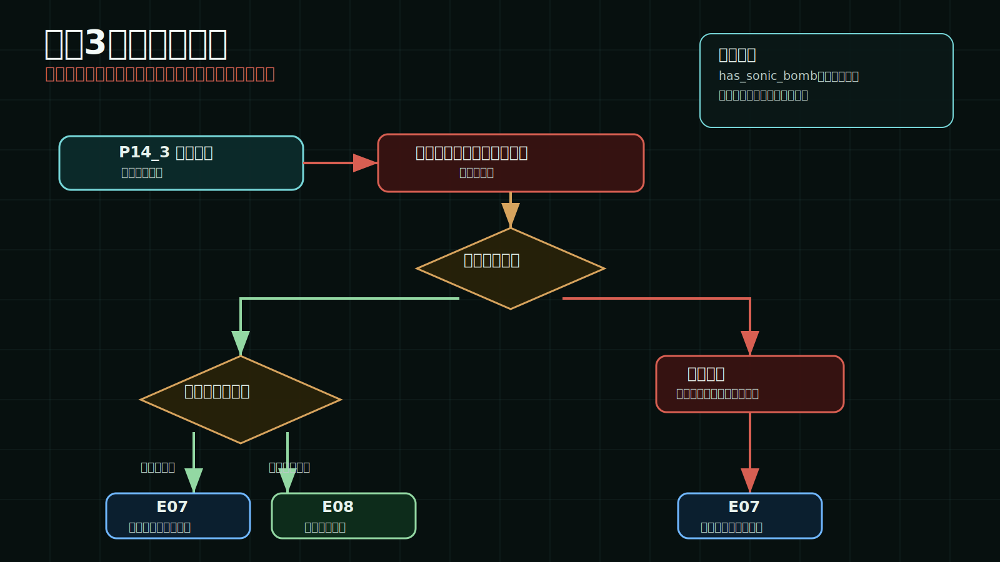
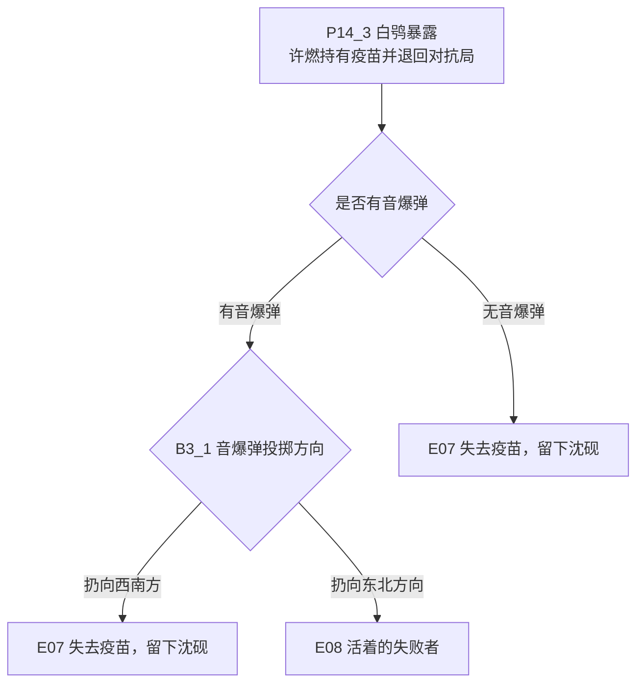

# 《微孔：疫苗坠落》故事线梳理

本文档依据当前可玩版本的 `src/gameData.ts` 与路线校验脚本整理，用于说明游戏现有全部故事线、关键分歧变量和 8 个可达结局。

## 总览

当前版本包含 1 条主角故事线：沈砚线。

沈砚线不是多主角并行结构，而是一条主线在中后段根据玩家选择分裂为 3 个大分歧：

- 分歧 1：疫苗给林禾。
- 分歧 2：疫苗给阿拓。
- 分歧 3：疫苗给许燃。

最终共有 8 个可达结局：

| 结局 | 名称 | 核心结果 |
| --- | --- | --- |
| E01 | 异化的希望 | 沈砚给自己使用疫苗，疫苗无效，沈砚异化并被阿拓击毙。 |
| E02 | 最后一枪 | 沈砚感染后自戕，林禾和阿拓获救但没有疫苗。 |
| E03 | 黑潮之后 | 小队被感染者吞没，对抗局等黑潮退去后取走疫苗。 |
| E04 | 冷舱里的队长 | 安全区拿回疫苗，沈砚被冷舱休眠带回。 |
| E05 | 带回问题的人 | 沈砚、林禾、阿拓带回疫苗并存活。 |
| E06 | 两枚铭牌 | 阿拓死亡，沈砚死亡，林禾带回沈砚和阿拓的铭牌。 |
| E07 | 失去疫苗，留下沈砚 | 对抗局带走疫苗，小队带回冷舱休眠的沈砚。 |
| E08 | 活着的失败者 | 沈砚、林禾、阿拓存活，但疫苗被对抗局带走。 |

## 核心玩法变量

这些变量共同决定故事线走向：

| 变量 | 触发位置 | 影响 |
| --- | --- | --- |
| `exposure_value` | P03 工厂外墙，选择正门或管道 | 主要影响风险表达与状态数值。 |
| `atok_saved_xuran` | P05 分组，是否让阿拓和许燃同行 | 决定分歧 2 中许燃是否杀死阿拓。 |
| `has_sonic_bomb` | P08 驾驶舱记录仪，是否拿音爆弹 | 决定多个终局是否可引开感染者。 |
| `vaccine_holder` | P10 巢穴冷箱，疫苗交给谁 | 直接进入林禾、阿拓、许燃三大分歧。 |
| `shenyan_infected` / `shenyan_state` | 终局战斗与撤离选择 | 决定沈砚死亡、异化、存活或冷舱休眠。 |
| `vaccine_recovered_by_safezone` / `vaccine_taken_by_opposition` | 各终局分支 | 决定疫苗最终回到安全区还是被对抗局夺走。 |

## 主线结构图

## 分歧 1：疫苗给林禾

林禾提前警觉许燃异常，许燃无法夺走疫苗，只能暴露为白鸮并退回对抗局。此分歧的核心问题是：沈砚是否继续与对抗局缠斗，以及队伍是否拥有音爆弹。

### 分歧 1 结局路径

| 路线 | 条件组合 | 结局 |
| --- | --- | --- |
| 林禾持疫苗 + 缠斗 + 有音爆弹 + 给自己使用疫苗 | 疫苗没有救沈砚，反而导致异化。 | E01 异化的希望 |
| 林禾持疫苗 + 缠斗 + 有音爆弹 + 自戕 | 沈砚拒绝把自己变成感染源。 | E02 最后一枪 |
| 林禾持疫苗 + 缠斗 + 无音爆弹 | 小队和对抗局都被感染者吞没。 | E03 黑潮之后 |
| 林禾持疫苗 + 撤离 + 有音爆弹 + 扔向西南方 | 引怪方向错误，沈砚感染后冷舱休眠。 | E04 冷舱里的队长 |
| 林禾持疫苗 + 撤离 + 有音爆弹 + 扔向东南方/西北方 | 三人带回疫苗并存活。 | E05 带回问题的人 |
| 林禾持疫苗 + 撤离 + 无音爆弹 + 冷舱休眠 | 疫苗回收，沈砚被冷舱带回。 | E04 冷舱里的队长 |
| 林禾持疫苗 + 撤离 + 无音爆弹 + 自戕 | 林禾和阿拓获救，但没有疫苗。 | E02 最后一枪 |

## 分歧 2：疫苗给阿拓

许燃靠近阿拓并暴露为白鸮。此分歧的核心问题是 P05 中阿拓是否救过许燃：如果救过，许燃放过阿拓；如果没救过，许燃会杀死阿拓。

### 分歧 2 结局路径

| 路线 | 条件组合 | 结局 |
| --- | --- | --- |
| 阿拓持疫苗 + 阿拓救过许燃 + 有音爆弹 + 扔向西南方 | 对抗局带走疫苗，沈砚感染后冷舱休眠。 | E07 失去疫苗，留下沈砚 |
| 阿拓持疫苗 + 阿拓救过许燃 + 有音爆弹 + 扔向东北方向 | 三人存活，但疫苗被对抗局带走。 | E08 活着的失败者 |
| 阿拓持疫苗 + 阿拓救过许燃 + 无音爆弹 | 沈砚感染后进入冷舱，疫苗丢失。 | E07 失去疫苗，留下沈砚 |
| 阿拓持疫苗 + 阿拓没救过许燃 | 阿拓被杀，沈砚感染并死亡，林禾带回两枚铭牌。 | E06 两枚铭牌 |

## 分歧 3：疫苗给许燃

这是最危险的交接选择。许燃就是白鸮，疫苗交给他后等于直接落入对抗局手中。此分歧不再检查阿拓是否救过许燃，核心只剩是否有音爆弹，以及音爆弹投向。

### 分歧 3 结局路径

| 路线 | 条件组合 | 结局 |
| --- | --- | --- |
| 许燃持疫苗 + 有音爆弹 + 扔向西南方 | 队伍失去疫苗，沈砚感染后冷舱休眠。 | E07 失去疫苗，留下沈砚 |
| 许燃持疫苗 + 有音爆弹 + 扔向东北方向 | 三人存活，但任务失败，疫苗被对抗局带走。 | E08 活着的失败者 |
| 许燃持疫苗 + 无音爆弹 | 队伍失去疫苗，沈砚感染后冷舱休眠。 | E07 失去疫苗，留下沈砚 |

## 结局到关键条件反查

| 结局 | 关键前置条件 | 沈砚状态 | 疫苗归属 |
| --- | --- | --- | --- |
| E01 异化的希望 | 疫苗给林禾；继续缠斗；有音爆弹；沈砚给自己使用疫苗。 | 异化后死亡 | 安全区未带回 |
| E02 最后一枪 | 疫苗给林禾；沈砚感染；选择自戕。 | 死亡 | 安全区未带回 |
| E03 黑潮之后 | 疫苗给林禾；继续缠斗；没有音爆弹。 | 死亡 | 对抗局取走 |
| E04 冷舱里的队长 | 疫苗给林禾；撤离过程中沈砚感染；进入冷舱。 | 冷舱休眠 | 安全区带回 |
| E05 带回问题的人 | 疫苗给林禾；撤离；有音爆弹；投向东南方或西北方。 | 存活 | 安全区带回 |
| E06 两枚铭牌 | 疫苗给阿拓；阿拓没有救过许燃；许燃杀阿拓；沈砚感染后死亡。 | 死亡 | 对抗局带走 |
| E07 失去疫苗，留下沈砚 | 疫苗给阿拓或许燃；突围失败或无音爆弹；沈砚进入冷舱。 | 冷舱休眠 | 对抗局带走 |
| E08 活着的失败者 | 疫苗给阿拓且阿拓救过许燃，或疫苗给许燃；有音爆弹；投向东北方向。 | 存活 | 对抗局带走 |

## 叙事主题

沈砚线的主题不是“找到疫苗就胜利”，而是“在疫苗不确定有效的前提下，玩家如何分配信任、风险和牺牲”。

三组核心判断贯穿全线：

- 信不信人：是否让阿拓和许燃同行，决定许燃后续是否保留一丝迟疑。
- 留不留工具：是否拿音爆弹，决定终局是否有引开感染者的手段。
- 交给谁：疫苗交给林禾、阿拓或许燃，决定白鸮暴露时小队是否还能守住疫苗。

因此，8 个结局并不是单纯的好坏排序，而是围绕三个问题展开：

- 希望是否被错误使用。
- 任务是否比活着回来更重要。
- 失去疫苗后，救回一个人是否仍算一种胜利。
